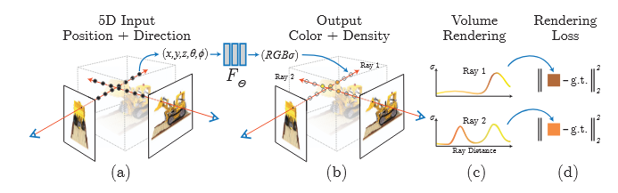

Primeiro estudo acerca do paper: [NeRF: Representing Scenes as Neural Radiance Fields for View Synthesis](https://arxiv.org/pdf/2003.08934)

O input é uma tupla que representa um espaço 5D, com coordenadas (x, y e z) espaciais cada qual mapeada em uma direção $(\theta, \empty)$ e uma densidade associada a cada ponto, a qual age como uma opacidade diferencial controlando a radiação acumulada de um raio atravessando-o.

Este projeto se usa de uma rede neural MLP(Multilayer perceptron), a qual não possui camadas convolucionais, para representar a função que mapeia a coordenada 5D $(x, y, z,\theta, \phi)$ para um único volume de densidade $\sigma$ e uma c = $(r, g, b)$ transformada pela visualização.

# Processo Iterativo
1) move-se os raios da câmera pela cena para gerar um conjunto de pontos 3D 
2) usa-se esses pontos e suas correspondentes direções de visualização 2D como entrada para a rede neural para produzir um conjunto de saída de cores e densidades 
3) usa-se técnicas clássicas de renderização de volume para acumular essas cores e densidades em uma imagem 2D.

Como esse processo é naturalmente diferenciável, conseguimos usar [gradiente descendente](descent-gradient.md) para otimizar os resultados.

# Renderização volumétrica
A densidade $\sigma(x)$ pode ser interpretada como a probabilidade diferencial de um raio terminar na n-ésima particula no ponto x.

